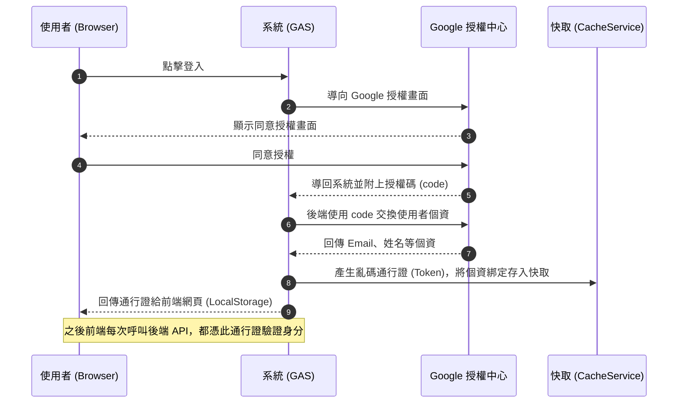

# Google Apps Script: 自建 OAuth2 驗證與「執行身分：我」完美整合新手全指南

這是一份專為新手設計師與開發者準備的完整教學指南。如果您希望打造一個 Google Apps Script (GAS) 網頁應用程式，並且符合以下兩個條件，這份指南就是為您準備的：

1. **所有人都可以看到網頁**，不用事先被加入白名單。
2. **系統需要知道現在登入的人是誰**（例如抓取他們的 Email 和姓名）。
3. **系統會將資料寫入「您自己（開發者）」的試算表中**，而不是強迫每個使用者都要自己開一份試算表。

---

## 🛑 為什麼不直接用內建功能？我們遇到了什麼困難？

在 GAS 中，要讓「所有人都能看網頁」，我們必須把**「執行身分」設為「我」**，並把**「誰可以存取」設為「所有人」**。
但是，一旦您這樣設定，Google 基於隱私保護，會把 `Session.getActiveUser().getEmail()` 這個內建指令給封鎖，導致您永遠只能抓到空白的 Email。

為了解決這個問題，我們必須「自己做一套登入系統（OAuth2）」。
也就是讓使用者點擊登入後，跑去 Google 的授權中心同意授權，然後把個資傳回我們的系統。

---

## 🏗️ 系統運作原理（白話文版）



1. **使用者點擊登入**：我們把使用者導向 Google 的授權畫面。
2. **Google 認證**：使用者同意授權後，Google 會把使用者導回我們的系統，並在網址後面偷偷塞一個密碼代號（稱為 `code`）。
3. **後端換取個資**：我們的系統後端收到 `code` 後，立刻跑去跟 Google 總部交換使用者的 Email 和姓名。
4. **發放通行證 (Token)**：為了不讓個資直接暴露在網址上，後端會自己產生一組亂碼通行證（Token），把個資跟通行證綁定後存入系統的「暫存記憶體 (Cache)」中。
5. **前端拿通行證做事**：後端把通行證丟給前端網頁。前端把通行證存在瀏覽器裡，以後每次呼叫後端要資料，都亮出這張通行證。後端核對無誤後，就會以「開發者」的最高權限幫使用者把資料寫進試算表。

---

## 📝 實戰詳細步驟 (Step-by-Step)

### 第一階段：去 Google Cloud Console 申請「登入金鑰」

要讓 Google 允許您的網站使用 Google 登入，您必須先去申請一把鑰匙。

1. 打開瀏覽器，前往 [Google Cloud Console](https://console.cloud.google.com/)。
2. 確認右上角是您的開發者帳號，然後在左上角點擊**選擇專案**（或建立一個新專案）。
3. 點擊左側選單的 **「API 和服務」** -> **「憑證」**。
4. 點擊畫面上的 **「＋建立憑證」** 按鈕，選擇 **「OAuth 用戶端 ID」**。
5. **應用程式類型**請選擇 **「網頁應用程式」**。
6. 給它取個名字（例如：自然科採購系統登入）。
7. **非常重要**：在 **「已授權的重新導向 URI」** 區塊，點擊「新增 URI」。
   - 請填入您 GAS 專案**正式發布的網址**（結尾是 `/exec` 的那個網址）。
   - *提示：如果您還沒有正式網址，可以先隨便填一個 `https://script.google.com/`，等最後發布拿到網址後，一定要記得回來這裡改！*
8. 點擊建立。畫面上會彈出一個視窗，裡面有 **「用戶端 ID」** 和 **「用戶端密碼」**，請把這兩串文字複製並存起來，等等會用到。

---

### 第二階段：將金鑰存入 GAS 的專案設定中

回到您的 Google Apps Script 編輯器畫面。

1. 點擊左側導覽列的 **「齒輪圖示 (專案設定)」**。
2. 滑到頁面最底部的 **「指令碼屬性」**，點擊 **「編輯指令碼屬性」** -> **「新增指令碼屬性」**。
3. 我們要建立兩個屬性：
   - 第一個：屬性名稱輸入 `CLIENT_ID`，值貼上您剛剛複製的用戶端 ID。
   - 第二個：屬性名稱輸入 `CLIENT_SECRET`，值貼上您剛剛複製的用戶端密碼。
4. 點擊 **「儲存指令碼屬性」**。
*(這樣做的好處是，金鑰不會直接寫在程式碼裡，不僅安全，程式碼看起來也更乾淨！)*

---

### 第三階段：授權給您自己的腳本程式

因為我們的程式碼需要幫使用者去跟 Google 總部連線（這需要用到 `UrlFetchApp` 服務），也需要把通行證存在記憶體裡（這需要用到 `CacheService` 服務）。
Google 規定，開發者必須**親自點擊允許**，這些進階服務才能運作。

1. 在左側選單點擊 **「<> 編輯器」**，打開您的 `code.js`。
2. 在程式碼的最下方，貼上這段測試用的程式碼：
   ```javascript
   function forceAuthPrompt() {
     UrlFetchApp.fetch("https://www.google.com");
     CacheService.getScriptCache().put("test", "123");
   }
   ```
3. 在網頁上方的工具列，找到執行按鈕旁邊的下拉選單（原本可能寫著 `doGet`），把它改成選擇 **`forceAuthPrompt`**。
4. 點擊 **「執行」**。
5. 畫面會彈出 **「需要授權」** 的視窗：
   - 點擊「審查權限」。
   - 選擇您的 Google 帳號。
   - 點擊左下角的「進階」。
   - 點擊「前往 xxx (不安全)」。
   - 點擊「允許」。
*(做完這一步，您的程式就正式打通任督二脈，擁有對外連線的權限了！)*

---

### 第四階段：最容易踩坑的「網址綁定」與「前端淨化」

新手最常遇到的問題就是：「為什麼我登入後會跳去一個找不到網頁的地方？」
這通常是因為網址的設定跑掉了，請務必檢查程式碼中的這兩個地方：

#### 1. 後端網址一定要「寫死」
在 `code.js` 中，找到獲取網址的函式 `getAppUrl()`。請**絕對不要**讓程式自動抓網址，請直接把您正式的 `/exec` 網址貼在裡面：
```javascript
// 動態取得 Web App URL
function getAppUrl() {
  // 請把下面這串換成您正式專案的 /exec 網址！
  return 'https://script.google.com/macros/s/您的正式發布ID/exec';
}
```

#### 2. 前端的「網址淨化」魔法
當使用者登入成功，系統把它導回首頁時，網址後面會帶著落落長的通行證（例如 `?session_token=XYZ`）。如果讓使用者看到這個，不僅很醜，萬一他複製網址傳給別人，別人就會變成他的身分登入！
所以在 `index.html` 的最上方 `<script>` 區塊，我們加入了這段魔法代碼：
```javascript
var templateSessionToken = '<?= sessionToken ?>';

if (templateSessionToken) {
  // 1. 把通行證偷偷存進瀏覽器的記憶體裡
  localStorage.setItem('my_app_token', templateSessionToken);
  
  // 2. 利用瀏覽器技術，把網址列上的參數「擦掉」，只保留乾淨的路徑
  window.history.replaceState({}, document.title, window.location.pathname);
}
```

---

### 第五階段：正確發布您的專案 (非常重要！)

只要程式碼有任何修改，如果沒有建立「新版本」，系統永遠只會跑舊的程式碼。這是 99% 新手會卡住的地方。

請嚴格遵守以下發布步驟：
1. 點擊右上角的藍色按鈕 **「部署」**。
2. 選擇 **「管理部署作業」**（千萬不要選「新增部署作業」，那會產生一個全新的網址）。
3. 點擊左上角列表旁的 **鉛筆圖示 (編輯)**。
4. 在「版本」的下拉選單中，**一定要選擇「建立新版本」**。
5. 檢查網頁應用程式的設定：
   - **執行身分**：請確保選擇 **「我 (Me)」** 或您的電子郵件地址。
   - **誰可以存取**：請確保選擇 **「所有人 (Anyone)」**。
6. 點擊 **「部署」**。

---

🎉 **恭喜您！** 🎉
到這裡，您已經建立了一套媲美專業軟體工程師架構的安全登入系統。您的設計不僅美觀，而且完美繞過了所有 Google Apps Script 針對權限與網域的嚴格限制！
