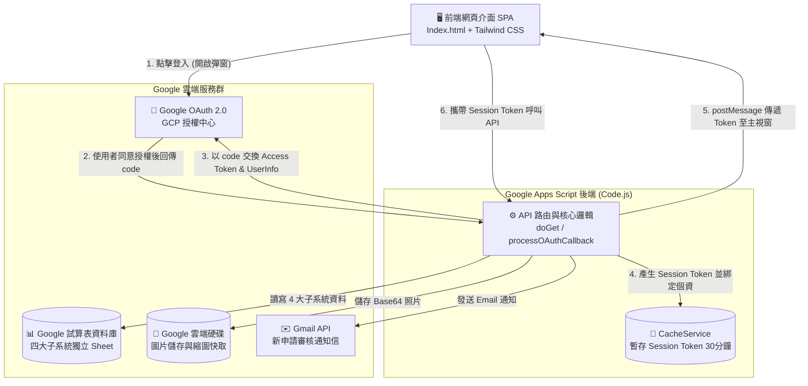
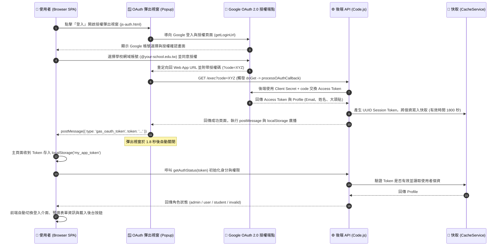

# 🏫 設備組 教學資源服務平台管理系統
## Google Apps Script: 自建 OAuth2 驗證與「執行身分：我」完美整合新手全指南

> 本指南專為管理員、開發者與維護人員設計，完整解析本平台如何透過 Google Cloud Platform (GCP) OAuth 2.0 與 Google Apps Script (GAS) 的 `CacheService` 打造安全、輕量且高效的無伺服器 (Serverless) 身分認證架構。

---

## 🛑 核心難題：為什麼需要自建 OAuth2？

在 Google Apps Script (GAS) 開發網頁應用程式時，若要達成以下三個核心目標：
1. **全校所有人皆可直接開啟網頁**（不需事先將數百名師生逐一手動加入 GCP 權限名單）。
2. **所有表單資料一律寫入開發者/設備組的共用 Google 試算表**（而非讓使用者在各自的雲端硬碟分散建表）。
3. **系統必須精確辨識登入者身分**（如抓取 Email、姓名以判斷一般教師、學生或管理員）。

GAS 官方規定：若將部署設定為**「執行身分：我 (開發者)」**且**「誰可以存取：所有人」**，基於資安與隱私防護，Google 會強制封鎖 `Session.getActiveUser().getEmail()`，導致後端永遠只能取回空白的 Email 字串。

**解決方案**：
本系統採用**自建 Google OAuth 2.0 授權流程**，透過前端彈出視窗 (Popup) 引導使用者登入 Google 帳號授權，後端即時向 Google Token 端點交換使用者資訊，並透過 `CacheService` 發放隨機 Session Token 通行證，完美兼顧全域存取、資料集中與身分安全。

---

## 🗺️ 系統架構圖 (System Architecture)


```mermaid
graph TD
    Client[🖥️ 前端網頁介面 SPA<br>Index.html + Tailwind CSS]
    
    subgraph GAS_Backend ["Google Apps Script 後端 (Code.js)"]
        GAS[⚙️ API 路由與核心邏輯<br>doGet / processOAuthCallback]
        Cache[(💾 CacheService<br>暫存 Session Token 30分鐘)]
    end
    
    subgraph Google_Cloud ["Google 雲端服務群"]
        OAuth[🔑 Google OAuth 2.0<br>GCP 授權中心]
        Sheets[(📊 Google 試算表資料庫<br>四大子系統獨立 Sheet)]
        Drive[(📁 Google 雲端硬碟<br>圖片儲存與縮圖快取)]
        Mail[✉️ Gmail API<br>新申請審核通知信]
    end

    Client -- 1. 點擊登入 (開啟彈窗) --> OAuth
    OAuth -- 2. 使用者同意授權後回傳 code --> GAS
    GAS -- 3. 以 code 交換 Access Token & UserInfo --> OAuth
    GAS -- 4. 產生 Session Token 並綁定個資 --> Cache
    GAS -- 5. postMessage 傳遞 Token 至主視窗 --> Client
    
    Client -- 6. 攜帶 Session Token 呼叫 API --> GAS
    GAS -- 讀寫 4 大子系統資料 --> Sheets
    GAS -- 儲存 Base64 照片 --> Drive
    GAS -- 發送 Email 通知 --> Mail
```

---

## 🏗️ 認證與授權時序流程 (Sequence Diagram)


```mermaid
sequenceDiagram
    autonumber
    participant U as 👤 使用者 (Browser SPA)
    participant P as 🪟 OAuth 彈出視窗 (Popup)
    participant G as 🔑 Google OAuth 2.0 授權端點
    participant GAS as ⚙️ 後端 API (Code.js)
    participant C as 💾 快取 (CacheService)

    U->>P: 點擊「登入」開啟授權彈出視窗 (js-auth.html)
    P->>G: 導向 Google 登入與授權頁面 (getLoginUrl)
    G-->>U: 顯示 Google 帳號選擇與授權確認畫面
    U->>G: 選擇學校網域帳號 (@your-school.edu.tw) 並同意授權
    G-->>P: 重定向回 Web App URL 並附帶授權碼 (?code=XYZ)
    P->>GAS: GET /exec?code=XYZ (觸發 doGet -> processOAuthCallback)
    GAS->>G: 後端使用 Client Secret + code 交換 Access Token
    G-->>GAS: 回傳 Access Token 與 Profile (Email、姓名、大頭貼)
    GAS->>C: 產生 UUID Session Token，將個資寫入快取 (有效時間 1800 秒)
    GAS-->>P: 回傳成功頁面，執行 postMessage 與 localStorage 廣播
    P-->>U: postMessage({ type: 'gas_oauth_token', token: '...' })
    Note over P: 彈出視窗於 1.8 秒後自動關閉
    U->>U: 主頁面收到 Token 存入 localStorage('my_app_token')
    U->>GAS: 呼叫 getAuthStatus(token) 初始化身分與權限
    GAS->>C: 驗證 Token 是否有效並讀取使用者個資
    C-->>GAS: 回傳 Profile
    GAS-->>U: 回傳角色狀態 (admin / user / student / invalid)
    U->>U: 前端自動切換登入介面、預填表單資訊與載入後台按鈕
```

---

## 🛡️ 多層級權限與角色分流 (RBAC)

系統後端 `Code.js` 之 `getAuthStatus()` 與 `verifySessionToken()` 內建多層級角色判斷：

| 角色代碼 | 身分名稱 | 判斷條件 | 開放功能與權限說明 |
| :--- | :--- | :--- | :--- |
| **`guest`** | 訪客 / 未登入 | 未提供 Token 或 Token 逾期 | 可瀏覽全校實驗室預約時間軸與週課表（姓名自動遮蔽如「趙O軒」）；無法填寫與提交申請表單。 |
| **`student`** | 學生帳號 | Email 符號為 6 位數字（例如 `s123456@` 或 `123456@`） | 僅開放**「教學實驗設備借用」**與**「實驗室預約」**；系統自動將申請人設為學生本人，並嚴格阻擋藥品與設備採購權限。 |
| **`user`** | 一般校內教師 | 帳號符合 `ALLOWED_DOMAIN` 且非學生、非管理員 | 開放使用**全部 4 大表單**、Excel 批次匯入藥品清單、檢視個人歷史清單、一鍵取消個人未審核紀錄。 |
| **`admin`** | 設備組管理員 | Email 列於 `ADMIN_EMAILS` 或預設管理員帳號名單 | 解鎖頂端審核選單、各子系統審核後台、單筆/批次狀態更新、自估單價/採購總價核算、SheetJS 匯出 Excel、系統環境變數圖形化設定。 |
| **`invalid`** | 非允許網域 | 登入非學校指定網域帳號 | 阻擋存取並跳出錯誤提示，要求切換為學校 Google 帳號。 |

---

## 📝 實戰建置步驟 (Step-by-Step)

### 第一階段：於 Google Cloud Console 申請「OAuth 2.0 憑證」

1. 開啟瀏覽器前往 [Google Cloud Console](https://console.cloud.google.com/)。
2. 建立新專案或選擇現有學校專案。
3. 進入左側選單 **「API 和服務」** > **「OAuth 同意畫面」**：
   - 選擇 **內部 (Internal)**（若為 Google Workspace 學校網域）或 **外部 (External)**。
   - 填寫應用程式名稱（例如：`設備組教學資源服務平台`）與管理員聯絡信箱。
   - 範圍 (Scopes) 勾選：`openid`, `.../auth/userinfo.email`, `.../auth/userinfo.profile`。
4. 進入左側選單 **「憑證」** > 點擊 **「＋建立憑證」** > 選擇 **「OAuth 用戶端 ID」**。
   - **應用程式類型**：選擇 **「網頁應用程式 (Web application)」**。
   - **名稱**：輸入 `教學資源平台 OAuth`。
   - **已授權的 JavaScript 來源**：保持空白或填入您的 Web App 來源網址。
   - **已授權的重新導向 URI**（極重要）：
     - 填入您 GAS 網頁應用程式正式發布的網址（以 `/exec` 結尾）。
     - *注意：若尚未發布，可先填寫暫存網址，待發布後再返回更新。*
5. 點擊「建立」後，複製並妥善保管彈出的 **用戶端 ID (CLIENT_ID)** 與 **用戶端密碼 (CLIENT_SECRET)**。

---

### 第二階段：設定 GAS 伺服器環境變數 (`PropertiesService`)

本系統已將所有環境參數（含試算表 ID、網域、金鑰與介面文字）抽離至伺服器屬性中，不需在程式碼中寫死：

#### 方法 A：透過 `Code.js` 的 `setupProperties()` 快速初始化
1. 開啟 GAS 專案編輯器，開啟 `Code.js`，滑至最底部的 `setupProperties()` 函式。
2. 填入您的各項 ID 與憑證：
   ```javascript
   function setupProperties() {
     const props = PropertiesService.getScriptProperties();
     props.setProperties({
       'SPREADSHEET_ID': '您的藥品請購試算表ID',
       'EQUIP_SHEET_ID': '您的設備申請試算表ID',
       'EQUIP_BORROW_SHEET_ID': '您的設備借用試算表ID',
       'LAB_SPREADSHEET_ID': '您的實驗室預約試算表ID',
       'FOLDER_ID': '您的圖片儲存資料夾ID',
       'WEB_APP_URL': 'https://script.google.com/macros/s/您的發布ID/exec',
       'ADMIN_EMAILS': 'admin1@your-school.edu.tw,admin2@your-school.edu.tw',
       'ALLOWED_DOMAIN': 'your-school.edu.tw',
       'CLIENT_ID': '您的GCP_CLIENT_ID.apps.googleusercontent.com',
       'CLIENT_SECRET': '您的GCP_CLIENT_SECRET',
       'SCHOOL_NAME': '國立鳳新高級中學',
       'SYSTEM_TITLE': '設備組 教學資源服務平台'
     });
     Logger.log('環境變數設定完成！');
   }
   ```
3. 於編輯器上方選擇 `setupProperties` 函式並點擊 **「執行」**。

#### 方法 B：透過前端管理後台圖形化修改
已具備管理員身分登入後，可直接點擊導覽列上的 **「系統設定」** 分頁，直接在網頁表單中修改基礎資訊或進階參數，系統會自動非同步寫入 `PropertiesService` 並即時生效。

---

### 第三階段：專案權限授權與發布

1. **觸發連線授權**：
   在 `Code.js` 中手動執行一次 `testEmail()` 或任何讀取試算表的函式，點擊「審查權限」>「進階」>「前往專案 (不安全)」>「允許」，授權專案使用 `SpreadsheetApp`、`UrlFetchApp`、`MailApp` 等服務。
2. **正式發布 Web App**：
   - 點擊右上角 **「部署」** > **「管理部署作業」**。
   - 點擊編輯圖示 > 版本選擇 **「建立新版本」**。
   - **執行身分**：務必選擇 **「我 (Me)」**。
   - **誰可以存取**：務必選擇 **「所有人 (Anyone)」**。
   - 點擊 **「部署」** 並複製產生的 `/exec` 網址。
3. **完成最後對接**：
   - 將該 `/exec` 網址填入 GCP Console 的「已授權的重新導向 URI」。
   - 將該 `/exec` 網址設定至系統參數 `WEB_APP_URL` 中。

---

## 💡 常見問題與除錯指南 (Troubleshooting)

### Q1: 點擊登入後，彈出視窗顯示 `redirect_uri_mismatch` 錯誤？
- **原因**：GCP Console 填寫的「已授權的重新導向 URI」與目前執行的 Web App 網址不一致。
- **解法**：請檢查目前瀏覽器網址列是否為 `/exec`，確認已將完整的網址（包含大小寫）精確複製至 GCP Console 的重新導向 URI 清單中。

### Q2: 登入成功後，彈出視窗關閉但主頁面沒有更新為登入狀態？
- **原因**：跨視窗通訊受到瀏覽器安全性策略限制或阻擋第三方 Cookie。
- **解法**：本系統已實作雙重接收機制：
  1. 優先透過 `window.opener.postMessage` 傳送 Token。
  2. 同步寫入 `localStorage.setItem('gas_auth_result', ...)`，主頁面內建 `storage` 事件監聽器自動捕捉 Token 並完成登入。

### Q3: 學生登入後，點選「藥品/物品請購」或「教學設備申請」會發生什麼事？
- **機制**：前端會自動停用提交按鈕並顯示「學生帳號權限受限」提示；若繞過前端直接呼叫後端 API，後端 `isBlockedUser()` 亦會二次驗證並直接拋出安全性拒絕錯誤。

---

<div align="center">
  <sub>🏫 國立鳳新高級中學 設備組 教學資源服務平台管理系統 | 身分驗證模組說明</sub>
</div>

