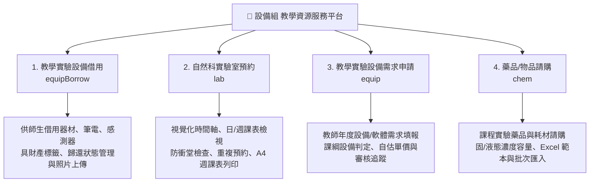

# 🏫 設備組 教學資源服務平台管理系統
(Equipment Section - Teaching Resources & Procurement Service Platform)

[](https://opensource.org/licenses/MIT)
[](https://github.com/SamnPhysics/sci-equip-hub/releases)
<!-- 尚未配置自動化測試，如後續新增可在此加入 CI Badge -->

> 基於 **Google Apps Script (GAS)** 與 **Tailwind CSS** 開發的現代化全方位學校教學資源與採購管理平台。由設備組統籌維運，整合**「教學設備借用」**、**「自然科實驗室預約」**、**「教學設備需求申請」**與**「藥品物品請購」**四大核心子系統，具備完善的 OAuth2 權限分級、高併發鎖定機制、背景預載快取與圖形化系統參數管理。

---

## 🌟 系統特色與核心架構

- **多元業務一站式整合**：整合全校教學與實驗設備借用、自然科實驗室即時預約、年度設備採購需求填報及化學藥品耗材請購，打破各表單分散管理的痛點。
- **半開放式安全存取 (SPA)**：首頁與實驗室課表開放全校瀏覽（預約姓名具備隱私遮蔽）；使用者需登入學校網域帳號後方可填寫申請或檢視歷史紀錄。
- **自建 Google OAuth2 授權安全架構**：
  - 突破 GAS「執行身分：我 (開發者)」無法透過 `Session.getActiveUser()` 獲取使用者 Email 的限制。
  - 透過彈出視窗 (Popup) 進行 Google OAuth 2.0 授權，完成後以 `postMessage` 傳回亂碼通行證 (Session Token)。
  - 後端 `CacheService` 綁定使用者身分（時效 30 分鐘，兼顧公用電腦安全性），每次 API 呼叫皆進行嚴格身分與網域檢驗。
- **多層級身分權限控制 (Role-Based Access Control)**：
  - 👤 **訪客 (Guest)**：未登入時可查看實驗室課表（顯示隱私遮蔽姓名如「趙O軒」）與申請規則說明，無法送出表單。
  - 🎓 **學生帳號 (Student)**：系統自動偵測 6 位數學生學號帳號，僅開放「教學實驗設備借用」與「實驗室預約」，限制請購與採購權限。
  - 👨‍🏫 **一般教師 (User)**：可使用四大申請表單、Excel 批次匯入藥品、查看個人申請/借用紀錄、一鍵取消個人未審核紀錄。
  - 🔑 **系統管理員 (Admin)**：解鎖頂端審核選單、各子系統審核管理面板、單筆/批次狀態更新（已請購/已購入/已歸還/不通過等）、自估單價/採購總價核算、一鍵匯出 Excel、系統環境變數圖形化設定與 Logo 雲端上傳。
- **實驗室視覺化排程與智慧防呆**：
  - 支援時間軸日檢視 (08:00~18:00)、週課表網格、教室篩選與空間容量資訊。
  - 智慧節次換算、多時段重複預約 (系列預約 groupId)、即時防衝堂檢查、個人預約綠色高亮標示、系列預約整批取消。
  - 內建專用樣板，支援一鍵 A4 直式正式週課表預覽與列印。
- **極致效能與現代化 UI/UX**：
  - 採用 Tailwind CSS、Font Awesome 6.5.1 與 HTML5 `<dialog>` 自訂精美 Modal/Alert/Confirm 視窗。
  - 支援圖片拖曳上傳、剪貼簿貼上 (<kbd>Ctrl+V</kbd>) 上傳、SheetJS 批次匯入與匯出。
  - 雙層快取機制 (`CacheService` + 前端 `SystemCache`) 與 `DocumentFragment` 批量 DOM 渲染，實現 0 秒瞬間切換體驗。
  - 後端全面採用 `LockService`，防止多名使用者同時提交或批次更新時造成試算表資料覆蓋衝突。

---

## 🗂️ 系統四大核心子系統



---

## 📂 專案檔案結構與模組職責說明

本專案採用高度模組化架構，將後端邏輯、前端視圖、元件樣板與各功能腳本清晰分層：

```text
scienceprocurement/
├── Code.js                         # 後端主程式 (GAS 伺服器邏輯、API 路由、試算表 CRUD、OAuth2)
├── appsscript.json                 # Google Apps Script 專案設定檔 (時區、V8 引擎、網頁應用程式配置)
├── OAuth2_GuideLine.md             # GCP OAuth 2.0 憑證申請與發布詳細指南
├── README.md                       # 系統說明文件
│
├── 🎨 前端主框架與樣式
│   ├── Index.html                  # 主頁面框架 (導覽列、側邊欄、對話框、分層模組載入)
│   └── Stylesheet.html             # Tailwind CSS 核心樣式庫與客製化樣式
│
├── 🧩 前端共用元件與樣板 (IndexComponent*.html)
│   ├── IndexComponentDatalist.html       # 共用資料清單元件 (年份/月份/關鍵字搜尋、分頁、批次更新、Excel 匯出)
│   ├── IndexComponentLabTemplates.html   # 實驗室預約前端 HTML5 <template> 樣板庫 (卡片、時段、日明細、週方塊)
│   ├── IndexComponentPrintSchedule.html  # 實驗室週課表 A4 專色列印專用樣板
│   └── IndexComponentUserMenu.html       # 右上角使用者個人選單與登出下拉選單
│
├── 📑 前端功能分頁視圖 (IndexTab-*.html)
│   ├── IndexTab-equipBorrow.html   # 【子系統 1】教學及實驗設備借用申請表單 (支援相片上傳、財產序號)
│   ├── IndexTab-lab.html           # 【子系統 2】自然科實驗室預約排程主畫面 (時間軸、日/週檢視、快速預約)
│   ├── IndexTab-equip.html         # 【子系統 3】教學及實驗設備需求申請表單 (課綱/非課綱設備/軟體、單價)
│   ├── IndexTab-chem.html          # 【子系統 4】藥品與物品請購申請表單 (固/液態藥品、Excel 批次匯入)
│   └── IndexTab-SystSetting.html   # 【系統後台】系統環境變數設定後台 (品牌設定、Logo 上傳預覽、試算表 ID)
│
└── ⚡ 前端 JavaScript 分層模組 (js-*.html)
    ├── js-core.html                # Layer 1: 核心工具 (Session Token、Debounce、DOM 快取、AppState、ApiService)
    ├── js-config.html              # Layer 1.5: 系統常數 (狀態選項、TABLE_COLUMNS_CONFIG 表格配置、日期過濾)
    ├── js-ui-utility.html          # Layer 2: UI 輔助工具 (Promise 版 window.alert / window.showConfirm 覆寫)
    ├── js-ui-widgets.html          # Layer 2: UI 核心類別 (PageNav 分頁控制、DataTableManager 資料表管理器)
    ├── js-auth.html                # Layer 3: 認證與授權 (Google OAuth 彈窗登入、Token 接收、登出)
    ├── js-switch.html              # Layer 3: 路由與身分介面 (Tab 切換、側邊欄縮放、依角色動態渲染 UI)
    ├── js-forms.html               # Layer 4: 表單與檔案 (三大表單提交、圖片拖曳/貼上 Base64 轉換、表單重置)
    ├── js-admin.html               # Layer 5: 管理功能 (審核清單渲染、狀態與總價更新、SheetJS 匯出、個人紀錄刪除)
    ├── js-settings.html            # Layer 5: 系統設定 (非同步讀寫 PropertiesService、Logo 上傳至 Drive)
    ├── js-lab-core.html            # Layer 6: 實驗室核心 (LabState 狀態、姓名隱私遮蔽、防衝堂邏輯)
    ├── js-lab-render.html          # Layer 7: 實驗室渲染 (DocumentFragment 時間軸渲染、教室卡片、週課性格子)
    ├── js-lab-modal.html           # Layer 8: 實驗室對話框 (新增預約/日明細/週課表 Modal、系列取消、A4 列印)
    └── js-main.html                # 模組索引說明與依賴規範檔
```

---

## ⚙️ 後端架構與分區索引 (`Code.js`)

`Code.js` 包含完整的 8 大功能分區，職責分明且具備高維護性：

| 分區 (Zone) | 功能區域名稱 | 主要函式與職責說明 |
| :--- | :--- | :--- |
| **ZONE 1** | 全域系統配置與參數中心 | 一次性讀取 `PropertiesService` 屬性 (`ENV_PROPS`)，定義試算表 ID、網域、UI 品牌字典。 |
| **ZONE 2** | 身分驗證與 OAuth2 安全模組 | `isAdminUser`, `isBlockedUser` (防學生請購), `getClientId`, `getLoginUrl`, `getAuthStatus`。 |
| **ZONE 3** | Web 路由與 HTML 渲染導覽 | `doGet` (處理 OAuth 回跳與首頁渲染), `processOAuthCallback` (Token 交換), `include` 樣板載入器。 |
| **ZONE 4** | 前台表單收件與寫入控制 | `submitApplication`, `submitEquipApplication`, `submitEquipBorrowApplication`, `batchSubmitApplication` (含 `LockService` 與 Gmail 通知)。 |
| **ZONE 5** | 資料檢視與管理員進階控制 | `getAdminData`, `getUserData`, `batchUpdateProcurementStatus`, `deleteUserRequests`, `logoutOAuth`。 |
| **ZONE 6** | 試算表存取引擎與快取映射 | `getSheetData` (5分鐘快取), `mapSheetRow` (欄位自動適配與轉換), `appendRowFromMap_`。 |
| **ZONE 7** | 自然科實驗室預約獨立核心 | `getLabData` (教室/節次/預約讀取), `submitLabBooking` (防衝堂檢查/重複預約), `cancelLabBooking` (單筆/系列取消)。 |
| **ZONE 8** | 系統屬性安裝與自訂 UI 設定 | `setupProperties` (初始環境建置), `getSystemSettings`, `saveSystemSettings`, `uploadLogoImage`。 |

---

## 📊 資料庫結構 (Google 試算表對應表)

系統採用 4 張獨立的 Google 試算表作為各子系統資料庫，主工作表名稱預設皆為 `表單回應 1`：

### 1. 藥品/物品請購試算表 (`SPREADSHEET_ID`)
- **工作表名稱**：`表單回應 1`
- **欄位列表**：
  1. `時間戳記` 2. `物品/藥品中文名稱` 3. `藥品英文名稱(含化學式，分子量)或物品名稱` 4. `所需數量` 5. `物品分類/化學藥品狀態` 6. `藥品濃度(液態)` 7. `課程使用時間` 8. `請勾選所需科別` 9. `申請人` 10. `電子郵件地址` 11. `物品/藥品照片` 12. `藥品容量(液態)` 13. `是否請購` 14. `備註` 15. `採購總價`

### 2. 教學及實驗設備需求申請試算表 (`EQUIP_SHEET_ID`)
- **工作表名稱**：`表單回應 1`
- **欄位列表**：
  1. `時間戳記` 2. `電子郵件地址` 3. `申請人` 4. `申請科別` 5. `設備名稱/軟體名稱` 6. `數量` 7. `自估單價` 8. `需求及用途說明` 9. `是否為課綱表定設備` 10. `設備或軟體存置地點` 11. `對應科別` 12. `是否購入` 13. `備註` 14. `採購總價` 15. `照片`

### 3. 教學實驗設備借用試算表 (`EQUIP_BORROW_SHEET_ID`)
- **工作表名稱**：`表單回應 1`
- **欄位列表**：
  1. `日期時間` 2. `科室` 3. `物品` 4. `數量` 5. `借用人` 6. `借用說明` 7. `是否歸還` 8. `備註` 9. `電子郵件` 10. `照片`

### 4. 自然科實驗室預約試算表 (`LAB_SPREADSHEET_ID`)
包含 3 個工作表：
- **`表單回應 1` (預約紀錄)**：
  1. `時間戳記` 2. `電子郵件` 3. `使用班級` 4. `申請教師` 5. `使用日期` 6. `使用節次` 7. `使用實驗室` 8. `實驗名稱/課程內容` 9. `實驗所需化學藥品` 10. `實驗所需器材` 11. `使用型態` 12. `人數` 13. `申請學生` 14. `(預留)` 15. `groupId` (系列預約識別碼)
- **`可預約教室列表` (教室清單)**：
  1. `教室代碼` 2. `教室名稱` 3. `地點/館別` 4. `容納人數` 5. `樓層`
- **`時間節數對應表` (時段對應)**：
  1. `節次名稱` (例如：第一節、第二節...) 2. `起訖時間` (例如：08:10-09:00)

---

## 🛠️ 安裝與部署指南 (Deployment Guide)

### 步驟 1：建立 GCP OAuth 2.0 用戶端憑證
詳見 [OAuth2_GuideLine.md](file:///c:/Users/chaus/%E8%A8%AD%E5%82%99%E7%B5%84%E8%97%A5%E5%93%81%E7%89%A9%E5%93%81%E6%8E%A1%E8%B3%BC%E7%AE%A1%E7%90%86/scienceprocurement/OAuth2_GuideLine.md)。
1. 前往 [Google Cloud Console](https://console.cloud.google.com/) 建立專案。
2. 進入「API 與服務」>「憑證」> 建立 **OAuth 用戶端 ID**（類型選「網頁應用程式」）。
3. 取得 `CLIENT_ID` 與 `CLIENT_SECRET`。

### 步驟 2：建立 Google 試算表與雲端資料夾
1. 依據上述【資料庫結構】建立 4 份 Google 試算表，並記下其試算表 ID。
2. 於 Google Drive 建立一個存放上傳圖片的資料夾，設定共用權限為**「知道連結的任何人均可檢視」**，並記下 `FOLDER_ID`。

### 步驟 3：設定 GAS 專案環境變數
1. 開啟 GAS 編輯器，前往 `Code.js` 底部的 `setupProperties()` 函式。
2. 填入您的環境參數：
   - `SPREADSHEET_ID`：藥品請購試算表 ID
   - `EQUIP_SHEET_ID`：設備需求申請試算表 ID
   - `EQUIP_BORROW_SHEET_ID`：設備借用試算表 ID
   - `LAB_SPREADSHEET_ID`：實驗室預約試算表 ID
   - `FOLDER_ID`：圖片儲存資料夾 ID
   - `ADMIN_EMAILS`：管理員信箱清單 (逗號分隔)
   - `ALLOWED_DOMAIN`：允許登入的學校網域 (例如：`your-school.edu.tw`)
   - `CLIENT_ID` 與 `CLIENT_SECRET`：GCP OAuth 憑證
   - `SCHOOL_NAME`, `SYSTEM_TITLE`, `SYSTEM_DESC` 等前端呈現文字
3. 於編輯器上方選擇 `setupProperties` 函式並點擊 **「執行」**。

### 步驟 4：發布網頁應用程式 (Web App)
1. 點擊編輯器右上角 **「部署」** > **「管理部署作業」**（或新增部署作業）。
2. 設定選項：
   - **種類**：`網頁應用程式`
   - **執行身分**：`我 (開發者帳號)`
   - **誰可以存取**：`所有人`
3. 部署完成後複製 **網頁應用程式網址 (Web App URL)**。
4. 將該網址填入：
   - GCP Console 的「已授權的重新導向 URI」。
   - GAS 的 `WEB_APP_URL` 系統屬性（或透過系統後台「系統設定」介面修改）。

---

## 🔒 系統安全性與權限規範

1. **Token 隔離機制**：Session Token 保存於伺服器端 `CacheService`，客戶端僅持有 UUID 字串，無 JWT 偽造或金鑰洩漏風險。
2. **網域嚴格白名單**：後端強制比對 Google 帳號網域，非授權網域帳號無法取得存取憑證。
3. **學生身分權限限縮**：學生帳號禁止提交藥品/設備採購申請，防杜未授權之採購行為。
4. **紀錄取消權限驗證**：一般使用者僅能取消/刪除屬於自己且尚未審核的申請紀錄，防止惡意刪除他人資料。
5. **圖片防破圖與縮圖機制**：Logo 與上傳照片全面採用 Google Drive 縮圖快取 API 渲染，避免權限與直連破圖問題。

---

## 📦 依賴套件與技術棧

- **後端執行環境**：Google Apps Script (V8 Engine)
- **Google Workspace API**：`SpreadsheetApp`, `DriveApp`, `MailApp`, `UrlFetchApp`, `CacheService`, `LockService`, `PropertiesService`
- **前端樣式**：[Tailwind CSS (OKLCH)](https://tailwindcss.com/)
- **圖示庫**：[Font Awesome 6.5.1](https://fontawesome.com/)
- **Excel 處理模組**：[SheetJS (xlsx.full.min.js 0.18.5)](https://sheetjs.com/)

---

## ⚠️ 已知限制與技術債 (Known Issues & Limitations)

在導入或部署本系統前，請評估以下基於 Google Apps Script (GAS) 環境所帶來的已知限制：
1. **身分驗證限制 (OAuth Workaround)**：
   - 因 GAS「以開發者身分執行」模式下，`Session.getActiveUser()` 無法取得終端使用者的 Email。本系統採用自建 GCP OAuth 2.0 授權，並需透過瀏覽器 Popup 彈窗完成登入。若使用者瀏覽器阻擋彈窗，可能導致登入失敗。
2. **無自動化測試與 CI/CD 機制**：
   - 專案目前缺乏自動化測試 (單元測試/整合測試) 腳本。針對包含採購與審核邏輯的核心功能，修改後仍需依賴手動測試確認，部署時請自行控管版本風險。
3. **GAS 執行時間限制與併發上限**：
   - Google 對單一 GAS 執行緒有 6 分鐘超時限制。大量批次處理（如匯入極大量藥品資料）時可能超時。
   - 雖已實作 `LockService`，但在極端高併發環境（例如全校同時預約同一節課）下，仍有可能遭遇鎖定逾時 (Timeout)。

---

## 🧪 測試與開發 (Testing & Development)

- 目前本專案**尚未建置自動化 CI/CD 流水線或單元測試**（未整合如 Jest 或 GitHub Actions 進行 GAS 單元測試）。
- 開發者若需修改涉及金流估價、採購審核狀態、預約防衝堂等核心邏輯（集中於 `Code.js` ZONE 4 與 ZONE 7），請務必於獨立的測試用試算表與 GAS 副本中進行手動驗證，確認無誤後再行部署至正式環境。

---

## 🔄 版本紀錄 (Changelog)

- 請參閱本專案的 [Releases](https://github.com/SamnPhysics/sci-equip-hub/releases) 頁面以獲取最新發布版本、更新內容與穩定版本資訊。建議部署時備註您所使用的版本號。

---

## 📜 授權條款 (License)

本專案採用 **[MIT License](https://opensource.org/licenses/MIT)** 授權條款。
作為公開範本 (Public template)，您可自由進行 Fork、修改、重製、用於學術或商業用途，唯須保留原作者著作權標示。

---

<div align="center">
  <sub>🏫 國立鳳新高級中學 設備組 教學資源服務平台管理系統 | 維護單位：設備組</sub>
</div>
